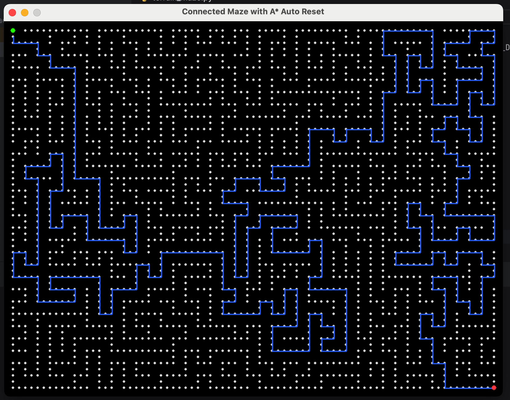

# 🧠 Intelligent Maze Pathfinding Using A* Search and Recursive Backtracker Maze Generation


> *Figure: The maze generated using Recursive Backtracker and solved optimally using A* Search.*

---

## 📘 Overview

This project demonstrates an intelligent **maze-solving system** that integrates two classical AI algorithms:

- **Recursive Backtracker** → for generating realistic, fully connected mazes (procedural generation).  
- **A\*** → for computing the **optimal path** from the start to the goal.

The system automatically regenerates a new maze after each solution, enabling continuous visualization of autonomous AI navigation.

Developed as part of a **Master’s project in Artificial Intelligence**, this implementation showcases the use of **heuristic search** and **procedural content generation** in dynamic environments.

---

## 🧠 Algorithms Used

### 🔹 Recursive Backtracker (Maze Generation)
A depth-first search (DFS)–based algorithm that generates *perfect mazes* (no loops or isolated sections).  
It starts from a random cell, carves a passage to unvisited cells, and backtracks when necessary.

**Complexity:** O(N)  
**Properties:** Produces solvable, visually connected mazes.

---

### 🔹 A* Search (Pathfinding)
An informed search algorithm combining Dijkstra’s and Greedy search.  
It uses the function:

\[
f(n) = g(n) + h(n)
\]
Where:  
- \( g(n) \): Cost from the start node to current node  
- \( h(n) \): Heuristic (Manhattan distance to goal)

**Complexity:** O(E log V)  
**Properties:** Guarantees optimal path when heuristic is admissible.

---

## 🧩 Features

- Procedural maze generation using DFS  
- Optimal pathfinding using A*  
- Realistic black-and-white visualization with thin lines  
- Blue path line for solution  
- Green start point and red goal point  
- Auto-regeneration of maze after solving  
- Real-time rendering using Pygame  

---

## ⚙️ Installation & Usage

### 🔧 Software Requirements
- Python 3.9 or higher  
- Pygame library installed (for graphics and visualization)

You can install Pygame by opening your terminal or command prompt and typing:
```bash
pip install pygame
```

---

### ▶️ Run Instructions

To run the intelligent maze pathfinding program, follow these steps carefully:

1. **Open the Project Folder**  
   Locate the folder that contains the project files on your computer.  
   Inside, you will find a Python file named **`maze_solver.py`**.

2. **Launch Python**  
   Open your Python environment (for example: **IDLE**, **VS Code**, or **PyCharm**).

3. **Open the Code File**  
   In your editor, go to *File → Open*, and select the file **`maze_solver.py`**.

4. **Run the Program**  
   Run the script (for example, press **F5** in IDLE or click **Run ▶️** in VS Code).  
   A new game window will open showing the maze.

5. **Understanding the Display**  
   - The **black background** represents the empty space.  
   - The **white lines** form the maze walls and corridors.  
   - The **green dot** marks the **start position**.  
   - The **red dot** marks the **goal position**.  

6. **Start Pathfinding**  
   Press the **Spacebar (SPACE)** key to begin the A* pathfinding algorithm.  
   A **thin blue line** will appear, showing the **optimal route** from start to end.

7. **Automatic Regeneration**  
   After the solution is displayed, the program will automatically generate a **new maze**  
   and repeat the process, demonstrating continuous autonomous solving.

8. **Exit the Program**  
   To close the window and stop the program, press the **ESC** key or click the close button.


